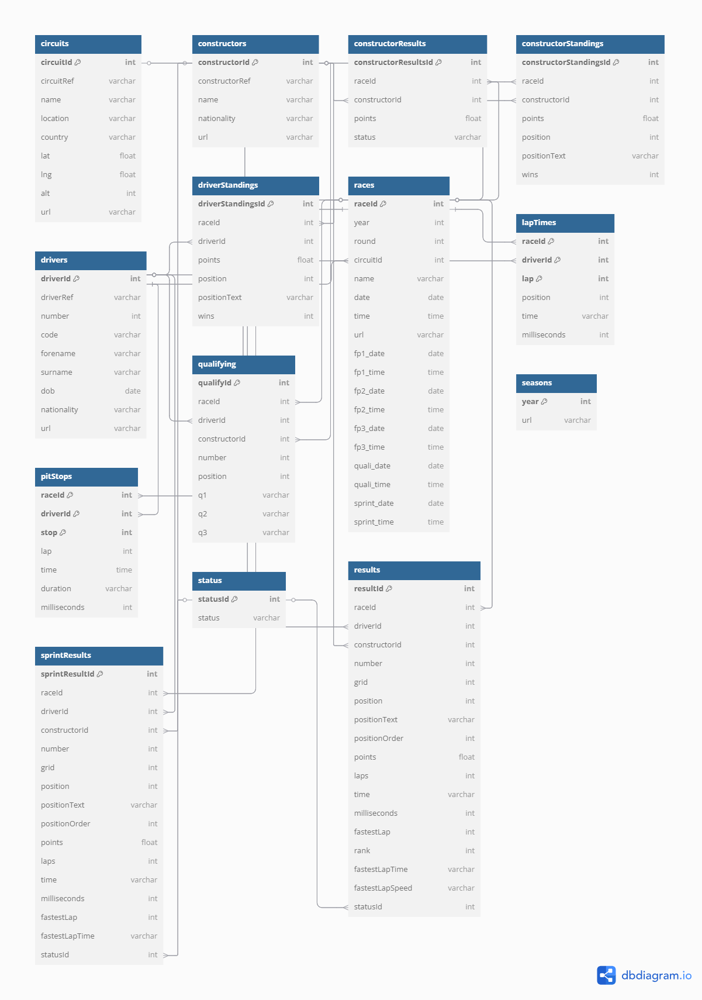

# Entity-Relationship Diagram (ERD)



# Formula 1 PostgreSQL Database Schema

This repository contains the SQL schema for a PostgreSQL database designed to store historical and current data about Formula 1 racing. It includes circuits, constructors, races, results, drivers, and more.

# Database Design Considerations

### Primary Keys

A Primary Key is a column (or set of columns) that uniquely identifies each record in a table. In this schema, each table has a primary key to ensure that no two rows can have the same identifier.

### Composite Keys
A Composite Key uses two or more columns to uniquely identify a record. 

### Unique Constraints on URL 
To ensure there are no duplicate URLs in the table.


## Schema Overview

All tables are defined under the `formula1` schema and represent various aspects of Formula 1 data.

---

## Tools used 
PostgreSQL  
[dbdiagram.io](https://dbdiagram.io)

## SQL Analysis (wip)


### Tables


```sql
drop table if exists formula1.circuits;

CREATE TABLE formula1.circuits (
  circuitId int NOT NULL ,
  circuitRef varchar(255) NOT NULL DEFAULT '',
  name varchar(255) NOT NULL DEFAULT '',
  location varchar(255) DEFAULT NULL,
  country varchar(255) DEFAULT NULL,
  lat float DEFAULT NULL,
  lng float DEFAULT NULL,
  alt int DEFAULT NULL,
  url varchar(255) NOT NULL DEFAULT '',
  PRIMARY KEY (circuitId),
  UNIQUE (url)
);


DROP TABLE IF EXISTS formula1.constructorResults;

CREATE TABLE formula1.constructorResults (
  constructorResultsId int NOT NULL ,
  raceId int NOT NULL DEFAULT '0',
  constructorId int NOT NULL DEFAULT '0',
  points float DEFAULT NULL,
  status varchar(255) DEFAULT NULL,
  PRIMARY KEY (constructorResultsId)
);


DROP TABLE IF EXISTS formula1.constructors;


CREATE TABLE formula1.constructors (
  constructorId int NOT NULL ,
  constructorRef varchar(255) NOT NULL DEFAULT '',
  name varchar(255) NOT NULL DEFAULT '',
  nationality varchar(255) DEFAULT NULL,
  url varchar(255) NOT NULL DEFAULT '',
  PRIMARY KEY (constructorId),
  UNIQUE (name)
);


DROP TABLE IF EXISTS formula1.constructorStandings;

CREATE TABLE formula1.constructorStandings (
  constructorStandingsId int NOT NULL ,
  raceId int NOT NULL DEFAULT '0',
  constructorId int NOT NULL DEFAULT '0',
  points float NOT NULL DEFAULT '0',
  position int DEFAULT NULL,
  positionText varchar(255) DEFAULT NULL,
  wins int NOT NULL DEFAULT '0',
  PRIMARY KEY (constructorStandingsId)
);


DROP TABLE IF EXISTS formula1.drivers CASCADE;

CREATE TABLE formula1.drivers (
  driverId int NOT NULL ,
  driverRef varchar(255) NOT NULL DEFAULT '',
  number int DEFAULT NULL,
  code varchar(3) DEFAULT NULL,
  forename varchar(255) NOT NULL DEFAULT '',
  surname varchar(255) NOT NULL DEFAULT '',
  dob date DEFAULT NULL,
  nationality varchar(255) DEFAULT NULL,
  url varchar(255) NOT NULL DEFAULT '',
  PRIMARY KEY (driverId),
  UNIQUE (URL) 
);


DROP TABLE IF EXISTS formula1.driverStandings;

CREATE TABLE formula1.driverStandings (
  driverStandingsId int NOT NULL ,
  raceId int NOT NULL DEFAULT '0',
  driverId int NOT NULL DEFAULT '0',
  points float NOT NULL DEFAULT '0',
  position int DEFAULT NULL,
  positionText varchar(255) DEFAULT NULL,
  wins int NOT NULL DEFAULT '0',
  PRIMARY KEY (driverStandingsId)
);


DROP TABLE IF EXISTS formula1.races CASCADE;

CREATE TABLE formula1.races (
  raceId int NOT NULL ,
  year int NOT NULL DEFAULT '0',
  round int NOT NULL DEFAULT '0',
  circuitId int NOT NULL DEFAULT '0',
  name varchar(255) NOT NULL DEFAULT '',
  date date,
  time time DEFAULT NULL,
  url varchar(255) DEFAULT NULL,
  fp1_date date DEFAULT NULL,
  fp1_time time DEFAULT NULL,
  fp2_date date DEFAULT NULL,
  fp2_time time DEFAULT NULL,
  fp3_date date DEFAULT NULL,
  fp3_time time DEFAULT NULL,
  quali_date date DEFAULT NULL,
  quali_time time DEFAULT NULL,
  sprint_date date DEFAULT NULL,
  sprint_time time DEFAULT NULL,
  PRIMARY KEY (raceId),
  UNIQUE (url)
);


DROP TABLE IF EXISTS formula1.lapTimes;

CREATE TABLE formula1.lapTimes (
  raceId int NOT NULL,
  driverId int NOT NULL,
  lap int NOT NULL,
  position int DEFAULT NULL,
  time varchar(255) DEFAULT NULL,
  milliseconds int DEFAULT NULL,
  PRIMARY KEY (raceId,driverId,lap)
);


DROP TABLE IF EXISTS formula1.pitStops;

CREATE TABLE formula1.pitStops (
  raceId int NOT NULL,
  driverId int NOT NULL,
  stop int NOT NULL,
  lap int NOT NULL,
  time time NOT NULL,
  duration varchar(255) DEFAULT NULL,
  milliseconds int DEFAULT NULL,
  PRIMARY KEY (raceId,driverId,"stop")
);


DROP TABLE IF EXISTS formula1.qualifying;

CREATE TABLE formula1.qualifying (
  qualifyId int NOT NULL ,
  raceId int NOT NULL DEFAULT '0',
  driverId int NOT NULL DEFAULT '0',
  constructorId int NOT NULL DEFAULT '0',
  number int NOT NULL DEFAULT '0',
  position int DEFAULT NULL,
  q1 varchar(255) DEFAULT NULL,
  q2 varchar(255) DEFAULT NULL,
  q3 varchar(255) DEFAULT NULL,
  PRIMARY KEY (qualifyId)
);


DROP TABLE IF EXISTS formula1.results;

CREATE TABLE formula1.results (
  resultId int NOT NULL ,
  raceId int NOT NULL DEFAULT '0',
  driverId int NOT NULL DEFAULT '0',
  constructorId int NOT NULL DEFAULT '0',
  number int DEFAULT NULL,
  grid int NOT NULL DEFAULT '0',
  position int DEFAULT NULL,
  positionText varchar(255) NOT NULL DEFAULT '',
  positionOrder int NOT NULL DEFAULT '0',
  points float NOT NULL DEFAULT '0',
  laps int NOT NULL DEFAULT '0',
  time varchar(255) DEFAULT NULL,
  milliseconds int DEFAULT NULL,
  fastestLap int DEFAULT NULL,
  rank int DEFAULT '0',
  fastestLapTime varchar(255) DEFAULT NULL,
  fastestLapSpeed varchar(255) DEFAULT NULL,
  statusId int NOT NULL DEFAULT '0',
  PRIMARY KEY (resultId)
);


DROP TABLE IF EXISTS formula1.seasons;

CREATE TABLE formula1.seasons (
  year int NOT NULL DEFAULT '0',
  url varchar(255) NOT NULL DEFAULT '',
  PRIMARY KEY ("year"),
  UNIQUE (url)
);


DROP TABLE IF EXISTS formula1.sprintResults;

CREATE TABLE formula1.sprintResults (
  sprintResultId int NOT NULL ,
  raceId int NOT NULL DEFAULT '0',
  driverId int NOT NULL DEFAULT '0',
  constructorId int NOT NULL DEFAULT '0',
  number int NOT NULL DEFAULT '0',
  grid int NOT NULL DEFAULT '0',
  position int DEFAULT NULL,
  positionText varchar(255) NOT NULL DEFAULT '',
  positionOrder int NOT NULL DEFAULT '0',
  points float NOT NULL DEFAULT '0',
  laps int NOT NULL DEFAULT '0',
  time varchar(255) DEFAULT NULL,
  milliseconds int DEFAULT NULL,
  fastestLap int DEFAULT NULL,
  fastestLapTime varchar(255) DEFAULT NULL,
  statusId int NOT NULL DEFAULT '0',
  PRIMARY KEY (sprintResultId)
);


DROP TABLE IF EXISTS formula1.status;

CREATE TABLE formula1.status (
  statusId int NOT NULL ,
  status varchar(255) NOT NULL DEFAULT '',
  PRIMARY KEY (statusId)
);


